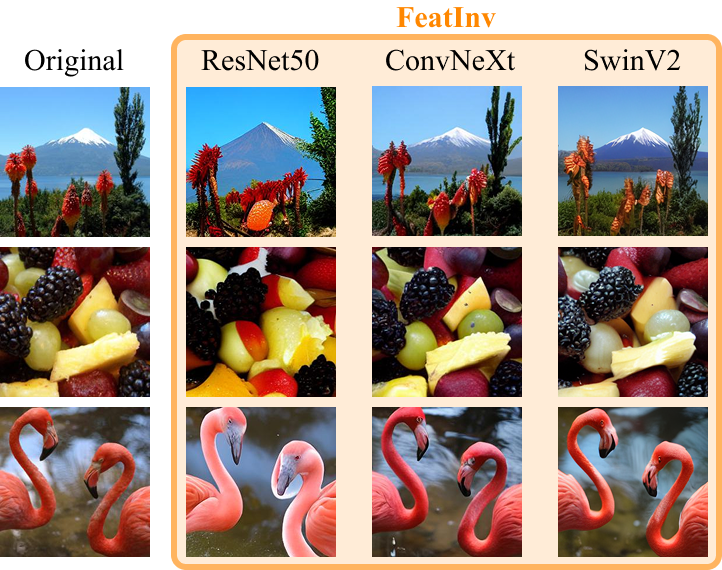

# FeatInv: Spatially resolved mapping from feature space to input space using conditional diffusion models

This is the official repository for the paper: [<ins>FeatInv: Spatially resolved mapping from feature space to input space using conditional diffusion models</ins>](https://arxiv.org/abs/2505.21032).

It is based on [ControlNet](https://github.com/lllyasviel/ControlNet), originally developed by [lllyasviel](https://github.com/lllyasviel). Licensed under the Apache License, Version 2.0. See [CHANGELOG.md](./CHANGELOG.md) for a list of changes and modifications from the original ControlNet project.

---

## 💡 What is FeatInv?

FeatInv is a method for interpreting deep neural networks by mapping internal feature representations back to input space using a conditional diffusion model. It enables high-fidelity reconstructions from spatially resolved feature maps across a variety of pretrained models (CNNs, ViTs), helping to visualize and understand what networks "see" and how they reason. This supports use cases like concept steering visualization and analysis of composite features in model internals.

For a detailed description of technical details and experimental results, please refer to our paper: <br> Nils Neukirch, Johanna Vielhaben, Nils Strodthoff: [FeatInv: Spatially resolved mapping from feature space to input space using conditional diffusion models](https://arxiv.org/abs/2505.21032).

## 📚 Citation

If you find our work helpful, please cite our paper:

```bibtex
@misc{neukirch2025featinvspatiallyresolvedmapping,
title={FeatInv: Spatially resolved mapping from feature space to input space using conditional diffusion models}, 
author={Nils Neukirch and Johanna Vielhaben and Nils Strodthoff},
year={2025},
eprint={2505.21032},
archivePrefix={arXiv},
primaryClass={cs.CV},
url={https://arxiv.org/abs/2505.21032}, 
}
```

## 🖼️ Example


## 🚀 Getting Started

### Requirements
First, install all necessary dependencies listed in [featinv.yaml](featinv.yaml) and activate the conda environment. This ensures that the correct Python packages and versions are available for FeatInv to run smoothly:
```bash
conda env create -f featinv.yaml
conda activate featinv
```

### Build a FeatInv Model and Start Training
Use the provided scripts to initialize your FeatInv model using pretrained [miniSD](https://huggingface.co/justinpinkney/miniSD) checkpoint, then start the training process. This will prepare the model to reconstruct inputs from feature representations.
```bash
python FeatInv/code/tool_add_control_featinv.py miniSD.ckpt control_featinv_convnext.ckpt
python FeatInv/code/tutorial_train_featinv.py
```

### Reconstruct Images from ImageNet Validation Set
After training, run this script to generate reconstructed images for 10 samples per ImageNet validation class, demonstrating the model’s ability to map features back to input space.
```bash
python FeatInv/code/featinv_imagenet_val_images_convnext.py
```

## 📄 License
This project is licensed under the [Apache License 2.0](LICENSE).